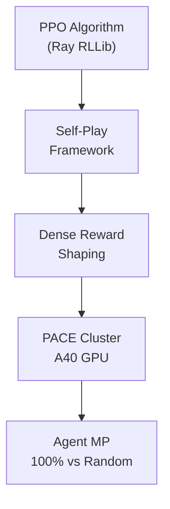

# SoccerTwos Agent MP — 训练策略详解

## 整体架构



## 1. 核心训练算法：PPO (Proximal Policy Optimization)

使用 Ray RLLib 的 PPO 实现，关键超参数：

| 参数 | 值 | 为什么这么选 |
|------|-----|------------|
| `lr` | 3e-4 | PPO 经典学习率 |
| `gamma` | 0.998 | 高折扣因子 — SoccerTwos episode 很长（~1000步），需要看到远期回报 |
| `lambda` (GAE) | 0.95 | 平衡 bias vs variance 的经典值 |
| `clip_param` | 0.2 | PPO clip 范围，防止策略更新过大 |
| `entropy_coeff` | 0.01 | 鼓励探索，防止策略过早收敛 |
| `kl_coeff` | 0.0 | 禁用 KL 惩罚，仅用 clip 做信任域限制 |
| `train_batch_size` | 16384 | 大 batch 提升训练稳定性 |
| `sgd_minibatch_size` | 4096 | 每个 SGD 步用 4096 样本 |
| `num_sgd_iter` | 10 | 每批数据做 10 次 SGD 迭代 |
| `grad_clip` | 0.5 | 梯度裁剪防止梯度爆炸 |

---

## 2. 网络架构

```
Input (obs_size=336)
    │
    ▼
┌──────────────────┐
│ FC Layer 1       │  336 → 512, ReLU
│ (512 neurons)    │
└───────┬──────────┘
        │
        ▼
┌──────────────────┐
│ FC Layer 2       │  512 → 512, ReLU
│ (512 neurons)    │  ← Value & Policy 共享这两层
└───────┬──────────┘
        │
    ┌───┴───┐
    ▼       ▼
┌────────┐ ┌────────┐
│Action  │ │Value   │
│Head    │ │Head    │
│512 → 9 │ │512 → 1 │
└────────┘ └────────┘
    │          │
    ▼          ▼
[3,3,3]    V(s)
```

- **观测空间**: 336维连续向量（包含自身位置/速度、队友位置、对手位置、球位置等）
- **动作空间**: `MultiDiscrete([3, 3, 3])` — 3个分支各3种选择（前后移动、左右转向、左右侧移）
- **`vf_share_layers=True`**: 策略和价值函数共享隐藏层，减少参数量

---

## 3. 自我对弈 (Self-Play) 策略

### 对手池设计

```python
policies = {
    "default":    # ← 主策略，唯一被训练的
    "opponent_1": # ← 最新的对手 (从 default 复制)
    "opponent_2": # ← 次新的对手
    "opponent_3": # ← 最旧的对手
}
```

### 对手采样概率

```python
# Team 0 (agents 0, 1): 始终用 default 策略
# Team 1 (agents 2, 3): 按概率从池中采样
p = [0.50, 0.25, 0.15, 0.10]
#    default  opp_1  opp_2  opp_3
```

- **50% 自我对弈** (default vs default) — 确保总是与最强版本对战
- **25% vs 最近的**历史版本 — 防止灾难性遗忘
- **15% + 10% vs 更旧的**版本 — 保持对早期策略的强健性

### 对手更新机制 (SelfPlayCallback)

```python
if episode_reward > 0.3 and iteration % 20 == 0:
    opponent_3 ← opponent_2  # 旧的移到队尾
    opponent_2 ← opponent_1  # 中间移到旧
    opponent_1 ← default     # 当前最优复制为新对手
```

触发条件：
1. 平均 episode reward > 0.3（说明 default 在赢）
2. 每 20 个 iteration 执行一次（避免过于频繁更新）

---

## 4. Dense Reward Shaping (核心创新)

### 问题
SoccerTwos 的原始奖励极其稀疏：
- 进球 → +1.0
- 被进球 → -1.0
- 其他所有步 → 0.0

在训练初期，4个随机策略根本碰不到球、更不会进球，导致无法学习。

### 解决方案：4个密集奖励信号

```python
class RewardShapingWrapper(gym.core.Wrapper):
```

| 奖励成分 | 权重 | 作用 |
|---------|------|------|
| **Ball Proximity** | 0.005 | 奖励减小与球的距离 → 学会追球 |
| **Ball-to-Goal** | 0.01 | 奖励球向对方球门移动 → 学会带球/射门 |
| **Goal Proximity** | 0.002 | 球靠近对方球门时给 bonus → 学会进攻 |
| **Existential Penalty** | -0.0001 | 每步轻微惩罚 → 学会尽快得分 |

### 设计原则
- 权重总和远小于进球奖励(1.0)，不会喧宾夺主
- 方向感知：Team 0 和 Team 1 的 Ball-to-Goal 奖励方向相反
- 差分奖励：基于位置变化量而非绝对位置，更稳定

---

## 5. 环境配置与并行化

### 并行结构

```
Driver (1 GPU)
    │
    ├── Worker 1 ─── Env 0, Env 1, Env 2  (3 Unity instances)
    ├── Worker 2 ─── Env 3, Env 4, Env 5
    ├── Worker 3 ─── Env 6, Env 7, Env 8
    ├── Worker 4 ─── Env 9, Env 10, Env 11
    ├── Worker 5 ─── Env 12, Env 13, Env 14
    ├── Worker 6 ─── Env 15, Env 16, Env 17
    ├── Worker 7 ─── Env 18, Env 19, Env 20
    └── Worker 8 ─── Env 21, Env 22, Env 23
    
    = 24 Unity instances, 96 agents
```

- **8 workers × 3 envs = 24 个 Unity 环境并行**
- Workers 在 CPU 上收集 rollout 数据
- Driver 在 GPU 上做 SGD 训练
- 减少到 8 workers（原16个）以避免端口冲突

### Config 传递中的 Bug Fix

```python
# ❌ 原始代码 (bug): pop会导致只有第一个env有reward shaping
use_reward_shaping = env_config.pop("reward_shaping", False)

# ✅ 修复后: get不会修改原始dict
use_reward_shaping = env_config.get("reward_shaping", False)
custom_keys = {"reward_shaping", "num_envs_per_worker"}
make_config = {k: v for k, v in env_config.items() if k not in custom_keys}
```

---

## 6. SLURM 集群配置

```bash
#SBATCH -N1 --ntasks-per-node=32   # 1个节点, 32 CPU核心
#SBATCH --gres=gpu:A40:1           # 1块A40 GPU
#SBATCH --mem=128G                 # 128GB 内存
#SBATCH -t12:00:00                 # 12小时时限
```

关键 HPC 适配：
- `ray.init(include_dashboard=False)` — 禁用 Ray Dashboard，避免 `socket.gaierror`
- `pkill -f SoccerTwos` — 清理残留 Unity 进程防止端口冲突
- `--error=soccertwos_mp-%j.err` — 分离 stdout/stderr 便于调试

---

## 7. 推理部署 (Agent MP)

```python
class AgentMP(AgentInterface):
    def act(self, observation):
        for player_id in observation:
            obs → tensor → model(obs) → logits
            logits → split [3,3,3] → softmax → argmax → action
        return actions
```

- 加载 `checkpoint.pth` (从 RLLib checkpoint 提取的纯 PyTorch 权重)
- 权重键名映射: `_hidden_layers.0._model.0.weight` → `fc1.weight`
- 推理时用 `argmax` (贪婪策略)，不做采样

---

## 8. 训练结果

| 指标 | 值 |
|------|-----|
| 总训练步数 | ~30M (917 iterations) |
| 训练时间 | ~10.7 小时 |
| 每 iteration | ~42 秒 |
| vs Random 胜率 | **100%** (134W-0L-0D) |
| 观测维度 | 336 |
| 模型参数量 | ~440K |

---

## 9. 文件结构总览

```
soccer-twos-starter/
├── train_selfplay_shaped.py      # 主训练脚本 (PPO + Self-Play)
├── reward_wrapper.py             # Dense Reward Shaping Wrapper
├── utils.py                      # RLLib 环境工厂 + 环境包装
├── extract_checkpoint_simple.py  # 从 RLLib checkpoint 提取权重
├── test_agent_vs_random.py       # 本地可视化测试
├── scripts/
│   └── soccerstwos_job.batch     # SLURM 集群提交脚本
└── our_agent/
    ├── agent.py                  # Agent MP 推理代码 (AgentInterface)
    ├── checkpoint.pth            # 训练好的模型权重
    └── README.md                 # Agent 说明
```
